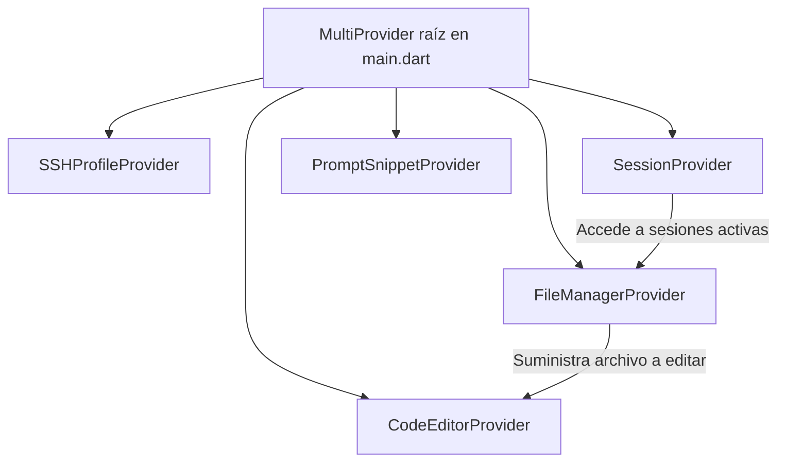

# Propuesta de Mejoras a KALA a Nivel de Productividad

Este documento presenta una propuesta integral de mejoras para **KALA**, dividida en dos pilares fundamentales:
1. **Productividad del Desarrollador (DX - Developer Experience):** Optimización de la arquitectura interna del código para facilitar el mantenimiento, la escalabilidad y las pruebas.
2. **Productividad del Usuario Final (UX - User Productivity):** Funcionalidades clave diseñadas para que el desarrollador que utiliza KALA desde un móvil o Linux trabaje de manera mucho más ágil y eficiente.

---

## 🏗️ 1. Arquitectura y DX: Modularización de `AppState`

### El Problema
Actualmente, todo el estado de la aplicación reside en un único monolito: [AppState](file:///home/jguadalupeandrade/JhonG/KALA_Terminal/lib/providers/app_state.dart). Esta clase supera las 2400 líneas de código y mezcla responsabilidades críticas:
* Persistencia y gestión de perfiles de conexión SSH.
* Orquestación de terminales multi-sesión (PTY y SSH).
* Explorador de archivos (navegación dual local/remota por SFTP).
* Lógica del editor de código (guardado, cambios).
* Sistema de plantillas de prompts (`snippets`).
* Detección del ciclo de vida de la aplicación.

**Consecuencias:**
* **Acoplamiento Alto:** Cualquier cambio pequeño en el estado de los archivos o en un prompt provoca que se dispare `notifyListeners()`, reconstruyendo partes de la UI no relacionadas.
* **Mantenibilidad Compleja:** Localizar bugs o añadir lógica a una clase de 90KB es propenso a errores.
* **Dificultad de Testing:** Probar de manera aislada la lógica del explorador de archivos requiere simular todo el entorno de terminal y perfiles SSH.

### La Solución: Arquitectura Multi-Provider
Proponemos descomponer [AppState](file:///home/jguadalupeandrade/JhonG/KALA_Terminal/lib/providers/app_state.dart) en sub-proveedores independientes con alcances muy delimitados:



1. **`SSHProfileProvider`:**
   * **Responsabilidad:** Cargar, guardar, editar y eliminar perfiles de conexión ([ConnectionProfile](file:///home/jguadalupeandrade/JhonG/KALA_Terminal/lib/models/connection_profile.dart)).
   * **Persistencia:** Integra directamente la lectura de `shared_preferences` y `secure_storage`.
2. **`SessionProvider`:**
   * **Responsabilidad:** Gestionar la lista de `TerminalSession`, el índice de la sesión activa y la creación/destrucción de shells (PTY local / SSH remoto).
3. **`FileManagerProvider`:**
   * **Responsabilidad:** Gestionar la navegación del explorador de archivos. Escucha los cambios del `SessionProvider` para refrescar el listado cuando cambia la sesión activa o su ruta.
4. **`CodeEditorProvider`:**
   * **Responsabilidad:** Manejar el estado del archivo abierto, control del cursor, indicador de cambios sin guardar (`isDirty`) y comunicación con el editor.
5. **`PromptSnippetProvider`:**
   * **Responsabilidad:** Almacenamiento y carga de plantillas de prompts rápidas.

### Beneficios
* **Reconstrucciones Selectivas:** Los widgets que renderizan la lista de archivos solo se suscriben a `FileManagerProvider`, evitando reconstruirse cuando se escribe texto en la terminal.
* **Código Limpio:** Cada archivo de Provider tendrá un tamaño menor a 500 líneas.
* **Testabilidad Real:** Permite escribir mocks específicos para `FileManagerProvider` y probar la navegación SFTP de forma aislada.

---

## 📝 2. Editor Multi-Pestañas (Multi-File Editor)

### El Problema
Actualmente, el editor de KALA solo permite editar un archivo a la vez ([editor_tab.dart](file:///home/jguadalupeandrade/JhonG/KALA_Terminal/lib/views/editor_tab.dart)). Si estás editando `main.dart` y necesitas verificar una función en `utils.dart`, debes cerrar `main.dart` (perdiendo tu posición de cursor e historial de cambios), navegar en el explorador, abrir `utils.dart`, leerlo, cerrarlo y volver a buscar y abrir `main.dart`.

### La Solución
Implementar un sistema de edición por pestañas dentro de `CodeEditorProvider`.

#### Estructura del Modelo:
```dart
class EditorTabState {
  final String path;
  final String filename;
  final bool isRemote;
  final CodeLineEditingController controller; // De re_editor
  bool isDirty;
  double scrollOffset;
  int cursorPosition;

  EditorTabState({
    required this.path,
    required this.filename,
    required this.isRemote,
    required this.controller,
    this.isDirty = false,
    this.scrollOffset = 0.0,
    this.cursorPosition = 0,
  });
}
```

#### Flujo de la Interfaz:
1. En la parte superior de la pestaña del Editor, se dibuja un listado horizontal con los nombres de los archivos abiertos (ej. `[ main.dart x ] [ app_state.dart * x ]`).
2. Al pulsar una pestaña, se restaura su `controller`, su posición de scroll y foco.
3. Se añade un punto indicador (`*`) si el archivo tiene cambios pendientes.
4. Al cerrar una pestaña con cambios sin guardar, se despliega un diálogo de confirmación: *¿Deseas guardar los cambios de main.dart antes de cerrar?*.

---

## 📊 3. Panel de Control VPS (Visual VPS Dashboard)

Escribir comandos complejos en terminales móviles es lento y propenso a errores tipográficos. Proponemos añadir un **Tab de Gestión Visual de Servidores** que use la sesión SSH de fondo para parsear información sin requerir un agente extra en el servidor.

### Características Principales:

1. **Monitor de Recursos en un Toque:**
   * Ejecuta periódicamente en segundo plano comandos livianos como:
     * CPU: `top -bn1 | grep "Cpu(s)"`
     * RAM: `free -m`
     * Disco: `df -h /`
   * Muestra gráficos sencillos de barras con el uso actual de estos recursos.

2. **Gestión de Servicios Systemd:**
   * Permite listar servicios clave del sistema configurados en una lista (ej. `nginx`, `docker`, `postgresql`, `pm2`).
   * Ofrece botones visuales para:
     * 🟢 **Iniciar** (`systemctl start <servicio>`)
     * 🔴 **Detener** (`systemctl stop <servicio>`)
     * 🔄 **Reiniciar** (`systemctl restart <servicio>`)
     * 📄 **Últimos logs** (`journalctl -u <servicio> -n 50 --no-pager`) expuestos en una hoja modal interactiva.

3. **Administrador de Procesos:**
   * Una tabla que parsea la salida de `ps -eo pid,ppid,cmd,%mem,%cpu --sort=-%cpu | head -n 20`.
   * Permite ordenar procesos por consumo de CPU/RAM y provee un botón de **"Kill"** que ejecuta `kill -9 <PID>` tras una confirmación.

---

## 🌿 4. Integración Visual de Git

Mantener el control de versiones desde el móvil suele requerir alternar constantemente entre el editor y la terminal para ejecutar comandos Git y ver qué archivos cambiaron.

### Propuesta de Integración:

1. **Estado Git en el Explorador de Archivos:**
   * Si la carpeta actual contiene un repositorio `.git` (detectado localmente o mediante `git status --porcelain` remoto), se consultará el estado de los archivos en segundo plano.
   * En el listado de archivos ([explorer_tab.dart](file:///home/jguadalupeandrade/JhonG/KALA_Terminal/lib/views/explorer_tab.dart)), se aplicará un código de color o ícono al nombre del archivo:
     * 🟢 **Verde (Added/Untracked):** Archivos nuevos no agregados o en stage.
     * 🟡 **Naranja (Modified):** Archivos modificados pendientes de commit.
     * 🔴 **Rojo (Conflicto):** Archivos con conflictos de merge.

2. **Gutter de Cambios en el Editor:**
   * Utilizar la API de decoración de líneas de `re_editor` para pintar barras verticales delgadas en el margen izquierdo (junto al número de línea) indicando si la línea fue agregada, modificada o eliminada con respecto a `HEAD`.

3. **Panel de Commit Rápido:**
   * Un botón o sección en el explorador de archivos que liste todos los archivos modificados.
   * Permita seleccionar cuáles añadir al stage (`git add`), ingresar un mensaje de commit en un campo de texto simple y realizar el commit (`git commit`).
   * Botones directos para hacer `git pull` y `git push` usando las credenciales/claves SSH del perfil activo.

---

## 🤖 5. Copiloto de IA Avanzado y Diagnóstico de Terminal

### 🔍 Diagnóstico Automático de Errores de Terminal
Cuando el usuario ejecuta un comando en la terminal y este retorna un código de error (exit code != 0), KALA puede interceptar la salida reciente.
* **Acción:** Mostrar una burbuja flotante discreta sobre la terminal: `[ 🔍 Explicar error con IA ]`.
* **Procesamiento:** Captura las últimas 20 líneas de la terminal y las envía a un proveedor de LLM local o remoto junto al prompt: *"Explica por qué falló este comando y sugiere el comando exacto para solucionarlo"*.
* **Aplicación:** El usuario puede pulsar "Copiar solución" o "Ejecutar comando propuesto" directamente.

### ⌨️ Autocompletado Inteligente en el Editor
* Aprovechar las sugerencias contextuales inline (estilo Ghost Text) integrando llamadas asíncronas de bajo retraso a un modelo de código (como CodeLlama o Gemini-nano en dispositivos compatibles).

---

## ⚙️ 6. Biblioteca de Comandos y Atajos Rápidos Customizables

Actualmente, KALA incluye un teclado inteligente con botones fijos como Ctrl, Alt, flechas, etc. ([terminal_tab.dart](file:///home/jguadalupeandrade/JhonG/KALA_Terminal/lib/views/terminal_tab.dart)). Sin embargo, cada desarrollador tiene comandos recurrentes según su stack tecnológico.

### La Solución:
Permitir que el usuario configure su propia **barra de atajos personalizados**:
* El desarrollador puede registrar comandos frecuentes (ej. `npm run dev`, `docker-compose up -d`, `git pull origin main`, `python main.py`).
* Estos atajos se renderizan como botones rápidos deslizables justo sobre la terminal.
* Al tocarlos, escriben y envían el comando de inmediato en la sesión activa, ahorrando valiosos segundos de escritura manual en teclado virtual.
